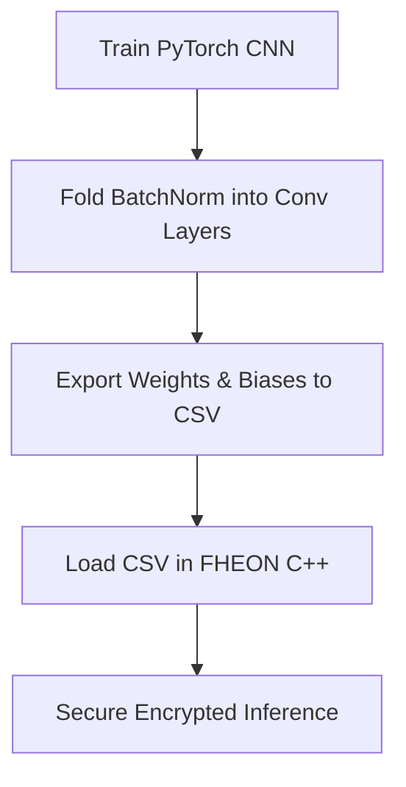

# FHEON: Configurable Framework for Building Encrypted Neural Networks

FHEON is a highly configurable framework designed for building **privacy-preserving convolutional neural networks (CNNs)** using **Homomorphic Encryption (HE)**. 

At its core, FHEON leverages the **Cheon–Kim–Kim–Song (CKKS) scheme** as implemented in the **OpenFHE** library. CKKS is an approximate homomorphic encryption method optimized for efficient floating-point computations on real-valued data. FHEON allows developers and researchers to develop and deploy neural networks directly in the encrypted domain, guaranteeing that sensitive inputs, model outputs, and intermediate states remain completely encrypted throughout computation.

This capability allows users to run complete inference tasks in the encrypted domain without ever exposing the underlying inputs, thereby ensuring strong data confidentiality. In doing so, FHEON enables secure deployment of machine learning models in sensitive environments, bridging the gap between utility and privacy in encrypted inference.

---

## Key Features

* **Privacy-Preserving Inference** for encrypted neural network evaluation.
* **Configurable CNN Layers** with familiar deep learning parameters.
* **Easy Extensibility** through a modular architecture.
* **Easy Model Design** using a clean and intuitive API.
* **Single and Batch Inference** support for different deployment scenarios.
* **Examples** for MLP, LeNet-5, VGG-11, VGG-16, ResNet-20, and ResNet-34 on MNIST, CIFAR-10, and CIFAR-100, including multiple optimized model variants.

FHEON provides a **flexible and efficient platform** for researchers and developers to build HE-friendly neural networks without sacrificing accuracy or privacy.

---

## Documentation

The full documentation for FHEON can be found on our website at:

[Read the FHEON Documentation](https://fheon.pqcsecure.org)

---


## Installation & Setup

You can build and run FHEON either **manually (natively)** or via **Docker**. For detailed building instructions, please refer to the [Build FHEON Documentation](https://fheon.pqcsecure.org/getting_started.html).


## Repository Structure

```
├── AllHEKeys/            # Generated key pair directories and serialization data
├── CMakeLists.txt        # Configurable CMake build definition
├── Dockerfile            # Multi-stage Docker image build specification
├── HEBatchModels/        # Batch/high-throughput model source code (TResNet20, TResNet34)
├── HESingleModels/       # Single-input model source code (LeNet5, ResNet20, ResNet34, VGG)
├── LICENSE.txt           # MIT License
├── README.md             # Project documentation (this file)
├── appendix.md           # Replication checklist and security notes
├── include/              # Header files for HE & NN controller pipelines
├── python/               # PyTorch training, BatchNorm folding, and weight export scripts
├── results/              # Ground truth labels, predictions, and verification utilities
├── run_docker_script.sh  # Developer-friendly helper script for Docker container management
├── src/                  # Core FHEON implementation files
└── weights/              # Folded model weights and biases stored in CSV format
```

---

## Requirements & Footprint

*   **Operating System**: Linux (tested on Ubuntu 20.04, 22.04, and 24.04).
*   **Compiler**: `gcc` 9+ or `clang` 10+ (supporting C++17).
*   **Build Tooling**: CMake 3.18+ and `make`.
*   **Python**: Python 3.8+ (for dataset accuracy checking and exporting weights).
*   **Hardware**: 
    *   Minimum: 4 CPU cores, 8 GB RAM.
    *   Recommended: 8+ CPU cores, 16+ GB RAM (compilation and execution on large models are computationally expensive).
*   **Resource Footprint**: Setup requires up to 50 GB storage depending on dataset size and caching options (when building OpenFHE and FHEON).

---

### Option A: Native Build (Manual Setup)

#### 1. Install System Dependencies
```bash
sudo apt-get update
sudo apt-get install build-essential cmake clang libomp5 libomp-dev ca-certificates git python3 -y
```

#### 2. Install OpenFHE (v1.4.2)
Clone, build, and install the required version of OpenFHE:
```bash
git clone --branch v1.4.2 https://github.com/openfheorg/openfhe-development.git
cd openfhe-development
mkdir build && cd build
# Disable examples, tests, and benchmarks to significantly speed up build times
cmake -DBUILD_UNITTESTS=OFF -DBUILD_EXAMPLES=OFF -DBUILD_BENCHMARKS=OFF ..
make -j$(nproc)
sudo make install
cd ../.. && rm -rf openfhe-development
```

#### 3. Compile FHEON
Clone this repository and compile with CMake:
```bash
git clone https://github.com/stamcenter/fheon.git
cd fheon
mkdir build && cd build
cmake -DMODE=ALL ..
make -j$(nproc)
```

---

### Option B: Docker Setup (Recommended)

FHEON includes a complete multi-stage `Dockerfile` and a developer script `run_docker_script.sh` to automate building and running inside a container.

```bash
# 1. Pull latest and build the Docker image
# This compiles OpenFHE and FHEON inside the container (takes ~30-60 mins depending on CPU)
./run_docker_script.sh build

# 2. Run specific models immediately inside Docker
./run_docker_script.sh run-lenet5
./run_docker_script.sh run-resnet20
./run_docker_script.sh run-resnet34

# 3. Verify predictions and check accuracy inside Docker
./run_docker_script.sh run-accuracy

# 4. Open an interactive shell inside the container
./run_docker_script.sh run
```

#### Docker Helper Commands Reference:
| Command | Description |
| :--- | :--- |
| `build` | Builds the Docker image (compiles OpenFHE and FHEON). |
| `build-nocache` | Builds the Docker image without cache (forces clean rebuild). |
| `run` | Starts an interactive bash session in the container. |
| `run-<model>` | Executes a specific model (options: `lenet5`, `resnet20`, `resnet34`, `vgg11`, `vgg16`). |
| `run-accuracy` | Runs the Python verification script in Docker. |
| `clean` | Removes stopped FHEON Docker containers. |
| `clean-image` | Removes FHEON containers, images, and cached layers completely. |

---

## Build Configuration Options

FHEON's compilation is fully parameterized. You can pass the following options during the CMake configuration step (`cmake -D<VARIABLE>=<VALUE> ..`):

### Parameters

| CMake Option | Allowed Values | Default | Description |
| :--- | :--- | :--- | :--- |
| **`MODE`** | `ALL`, `SINGLE_INPUTS`, `BATCH_INPUTS` | `ALL` | Pipeline mode: single-input models, batched models, or both. |
| **`SINGLE_MODEL`** | `ALL`, `BasicMLP`, `LeNet5`, `ResNet20`, `VGG11`, `VGG16`, `ResNet34` | `ALL` | Specific single-input model to compile (applicable if `MODE` is `SINGLE_INPUTS` or `ALL`). |
| **`BATCH_MODEL`** | `ALL`, `ResNet20`, `ResNet34` | `ALL` | Specific batch model to compile (applicable if `MODE` is `BATCH_INPUTS` or `ALL`). |
| **`BATCH_SIZE`** | `ALL`, `16`, `32`, `64`, `128`, `256`, `512` | `ALL` | Specific batch size to compile (applicable if `MODE` is `BATCH_INPUTS` or `ALL`). |
| **`TEST_SIZE`** | Integer (e.g. `10`, `20`, `50`) | `10` | Default test dataset size embedded in single-input model executables. |
| **`BUILD_STATIC`** | `ON`, `OFF` | `OFF` | Link against OpenFHE's static libraries instead of shared libraries. |

> [!NOTE]
> Setting parameters to `ALL` compiles all available options/variants under that mode. It might take longer but generates all binaries.

### Compilation Examples

**Build all models (default)**
```bash
cmake ..
make -j$(nproc)
```

**Build only single-input models**
```bash
cmake -DMODE=SINGLE_INPUTS ..
make -j$(nproc)
```

**Build only ResNet20 single-input model**
```bash
cmake -DMODE=SINGLE_INPUTS -DSINGLE_MODEL=ResNet20 ..
make -j$(nproc)
```

**Build high-throughput ResNet20 with batch size 64**
```bash
cmake -DMODE=BATCH_INPUTS -DBATCH_MODEL=ResNet20 -DBATCH_SIZE=64 ..
make -j$(nproc)
```

**Build all high-throughput models with batch size 128**
```bash
cmake -DMODE=BATCH_INPUTS -DBATCH_SIZE=128 ..
make -j$(nproc)
```

**Build all models - single-input and high-throughput with batch size 256**
```bash
cmake -DMODE=ALL -DBATCH_SIZE=256 ..
make -j$(nproc)
```

### Static vs Shared Libraries

By default, FHEON links against OpenFHE's shared libraries. To build with static libraries:

```bash
cmake -DBUILD_STATIC=ON ..
make -j$(nproc)
```

### Build Output

All compiled executables are placed in the `build/` directory. Each model is compiled as a separate executable with a name corresponding to the model configuration (e.g., `ResNet20Basic`, `TResNet20N64`).

---

## Supported Models

FHEON supports a variety of CNN architectures across different evaluation modes:

[Visit FHEON Documentation for more information on the different models and variants](https://fheon.pqcsecure.org)

---

## Running & Verifying Models

### 1. Execute Binaries
All compiled executables are stored directly in your `build` directory. Each executable name corresponds to the model configuration:

```bash
# Run LeNet-5 (Single-Input)
./build/LeNet5

# Run ResNet-20 (Optimized Single-Input)
./build/ResNet20Optimized

# Run Batched ResNet-20 with a batch size of 64
./build/TResNet20N64
```

#### Runtime Arguments
For single-input executables, you can override the default test dataset size at runtime by passing the `--test_size` argument:
```bash
./build/ResNet20Optimized --test_size 25
```

---

### 2. Accuracy Verification
To verify the accuracy of the predictions computed in the encrypted domain, a python utility compares predictions against ground-truth labels. 

After running the C++ binaries, change into the `results` folder and run `accuracy.py`:
```bash
cd results
python3 accuracy.py
```
This will print out accuracy comparisons between PyTorch (plaintext reference) and FHE (encrypted inference) for each run model:
```
PyTorch LeNet5 Accuracy: 90.0% (9/10 lines)
FHE LeNet5 Accuracy: 90.0% (9/10 lines)
PyTorch ResNet20 Accuracy: 100.0% (10/10 lines)
FHE ResNet20 Accuracy: 100.0% (10/10 lines)
```

---

## Model Export & Deployment Workflow

Developers can train models in PyTorch and export them for secure execution under FHEON. 



### 1. Fold BatchNorm & Export Weights
Homomorphic evaluation of BatchNorm layers is computationally prohibitive in the encrypted domain due to division and square root operations. FHEON solves this by **folding BatchNorm parameters** into preceding Convolutional layer weights and biases at inference time.

The script `python/exporting_weights.py` demonstrates this process:
1. Load a pre-trained PyTorch model.
2. Mathematically fold running mean, variance, scale ($\gamma$), and shift ($\beta$) parameters directly into the convolution filters:
   $$W_{\text{folded}} = W \cdot \frac{\gamma}{\sqrt{\sigma^2 + \epsilon}}$$
   $$B_{\text{folded}} = \gamma \cdot \frac{B - \mu}{\sqrt{\sigma^2 + \epsilon}} + \beta$$
3. Replaces BatchNorm modules with `nn.Identity`.
4. Saves the folded parameters to 1D flattened CSV files ready to be loaded by the FHEON engine.

Run the script by customizing the data path and loading path inside `python/exporting_weights.py` and running:
```bash
cd python
pip install -r requirements.txt
python3 exporting_weights.py
```

### 2. Load Weights in FHEON
Place the exported `.csv` files into the `weights/` folder under the correct model directory. FHEON's model definitions will automatically load them using the internal parser at runtime.

---

## Academic Citations

If you use FHEON in your research, please cite our publications:

### Encrypted Single-Input Inference
```bibtex
@misc{njungle2025fheonconfigurableframeworkdeveloping,
      title={FHEON: A Configurable Framework for Developing Privacy-Preserving Neural Networks Using Homomorphic Encryption}, 
      author={Nges Brian Njungle and Eric Jahns and Michel A. Kinsy},
      year={2025},
      eprint={2510.03996},
      archivePrefix={arXiv},
      primaryClass={cs.CR},
      url={https://arxiv.org/abs/2510.03996}, 
}
```

Also available online at:
[FHEON: A Configurable Framework for Developing Encrypted Privacy-Preserving Neural Networks Using Homomorphic Encryption](https://arxiv.org/abs/2510.03996)

### Encrypted High-Throughput Inference
```bibtex
@misc{njungle2026deepencryptedtraininglowlatency,
      title={Towards Deep Encrypted Training: Low-Latency, Memory-Efficient, and High-Throughput Inference for Privacy-Preserving Neural Networks}, 
      author={Nges Brian Njungle and Eric Jahns and Michel A. Kinsy},
      year={2026},
      eprint={2604.16834},
      archivePrefix={arXiv},
      primaryClass={cs.CR},
      url={https://arxiv.org/abs/2604.16834}, 
}
```

Also available online at:
[Towards Deep Encrypted Training: Low-Latency, Memory-Efficient, and High-Throughput Inference for Privacy-Preserving Neural Networks](https://arxiv.org/abs/2604.16834)

---

## License

This project is licensed under the [MIT License](LICENSE.txt).
